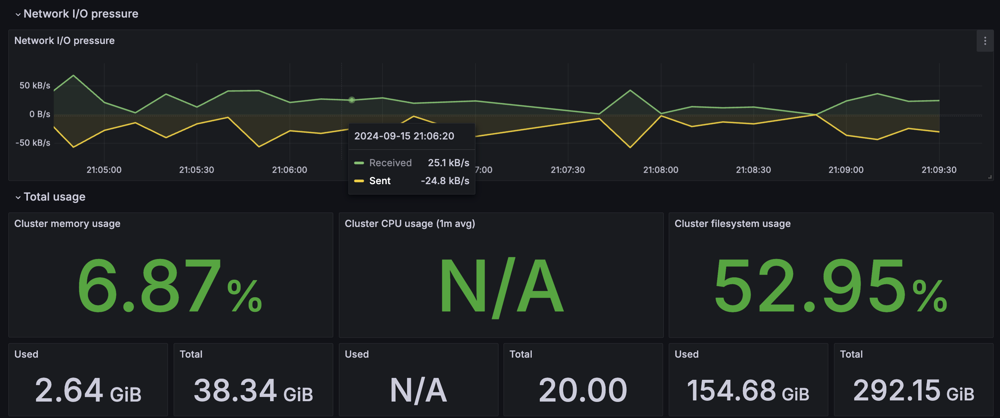

## 硬體設置
```bash=
# 建立一個 kind cluster
kind create cluster --config kind-cluster.yaml

# 安裝 kube-state-metrics, prometheus
helm install kube-state-metrics prometheus-community/kube-state-metrics
helm install prometheus prometheus-community/prometheus -f ./prometheus/values.yaml
# 將 prometheus 的 port-forward 讓 Grafana 存取 metrics
kubectl port-forward svc/prometheus-server 9090:80

# 安裝 grafana
docker run -d --name=grafana -p 3000:3000 grafana/grafana
```

## 監控設置
### Grafana
:point_right: Dashboard 來源選擇 :point_left: 
Node 監控
`Create -> import -> Dashboard ID:1860 -> 選擇 prometheus 作為資料來源`
Cluster 監控
`Create -> import -> Dashboard ID:1621 -> 選擇 prometheus 作為資料來源`

## Node 監控

- Pressure: 透過監控 process 的 pending 累積時間，以及 irate() 的瞬時變化計算，來呈現目前 CPU 的壓力值。
`eg. 20% 表示一個 process 完整的處理時間中，約莫有 20% 的時間在等待 CPU，若過高，則表是有 CPU 資源競爭的情況`
- CPU Busy: CPU 的忙碌程度
`eg. 50% 表示過去這段時間有 50% 的時間 CPU is not idle`
- Sys Load: 表示過去一段時間內 CPU 的負載情形
`CPU 的附載情形，若高於 CPU 核心數，則可能出現 Throttling`
- RAM Used: RAM 的使用率
- - SWAP Used: SWAP 的使用情況
- Root Fs Used: 可用儲存空間
- Basic CPU: CPU 在 System/User/IOwait/IRQs/Other 狀態下的運行資源佔比

## Cluster 監控

- Cluster memory usage
- Cluster CPU usage (1m avg)
- Cluster filesystem usage

<br/>

> ## HPA 設置

```bash=
# 建置 namespace
kubectl create namespace demo

# helm
helm install node-service ./node-service --namespace demo

# hpa 的依賴 metrics servicer
kubectl apply -f https://github.com/kubernetes-sigs/metrics-server/releases/latest/download/components.yaml
kubectl apply -f ./service/metrics-server.yaml

# 透過 svc port-forward 讓 k6 有路徑可以灌壓測
kubectl port-forward svc/node-service-demo-svc 8888:80 --namespace demo
```

透過 k6 灌壓測


```base=
# cd /path/to/k6
cd service/k6
k6 run test.js
```
